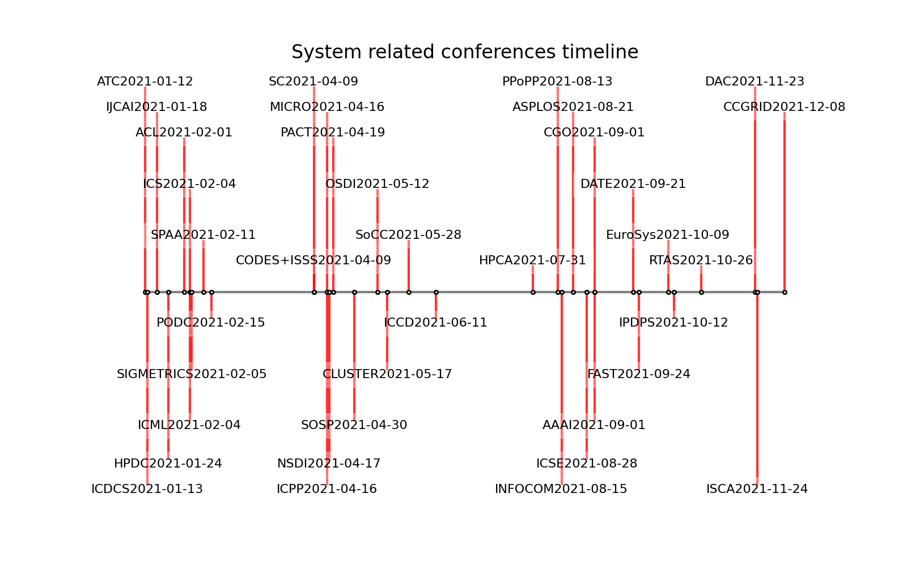

# Readme

This is a python crawler and timeline for system conference papers. The rank of conferences is higher than CCF-B or CORE-A.

## Timeline

We draw a simple timeline to visualize the submission deadline of these conferences. We use the 2020 and 2021 conferences timestamp as the raw data. The submission deadline is around this timestamp across years.

* You can use the timeline to decide how long to prepare for your paper

